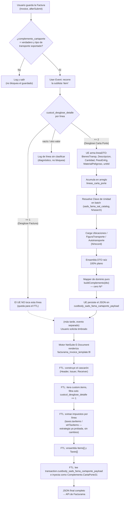

# Orquestación del payload híbrido: Factura con Complemento Carta Porte

Documento de diseño — cero código fuente en esta fase. Referencias analizadas:
`Analisis_Comparativo_CartaPorte.md` (mapeo de nodos) y `Tests/Pruebas de E Docs NS CLI API/Plantillas/facturama_invoice_template.ftl` (estrategia de impuestos ya probada, líneas 114-197).

## 1. Análisis Arquitectónico y Propuesta de Flujo

### Composición, no herencia: dos relojes distintos, un solo JSON

El User Event y la plantilla FTL no se llaman entre sí — se componen en el tiempo. El UE corre en
`afterSubmit`, al guardar la Factura; el FTL corre después, en un momento distinto (cuando el
motor de NetSuite genera el E-Document, que puede ser inmediato o hasta que alguien solicite el
timbrado). El UE deja su resultado **persistido** en un campo de texto del registro
(`custbody_sads_fama_cartaporte_payload`); el FTL, al renderizar, lo **lee** como un bloque ya
resuelto y lo inyecta en la posición correcta del JSON final. No hay invocación directa entre
ambos — es composición por datos compartidos en el propio registro, el mismo patrón que ya usa
`facturama_traslado_template.ftl` con su propio User Event.

### Por qué la frontera cae exactamente en `custcol_desglose_detalle`

Este campo de línea ya es, por sí mismo, la decisión de negocio tomada por el usuario en
NetSuite — ni el UE ni el FTL "deciden" nada al leerlo, solo enrutan según un dato que ya existe.
Eso es lo que permite partir la responsabilidad sin que ninguno de los dos lados invente una
regla nueva:

- **Valor `1` ("Desglose Factura")** → la línea es una línea facturable real: tiene importe,
  impuestos, objeto de impuesto. Toda esa lógica ya vive, probada, en el FTL (líneas 125-195 de
  `facturama_invoice_template.ftl`: `Impuestos_Trasladados`/`Impuestos_Retenidos`,
  `taxes.taxItems`/`taxes.whTaxItems`, `getTaxName()`). Mover ese cálculo al UE sería duplicar
  lógica ya correcta y ya validada contra Facturama — exactamente lo que la regla de negocio
  prohíbe.
- **Valor `2` ("Desglose Carta Porte")** → la línea es mercancía transportada, sin relación con
  el cálculo de impuestos. Necesita resolver Clave de Unidad SAT vía `N/search`
  (`sads_fama_sat_catalog.resolveClavesUnidad`) y cargar custom records relacionados
  (Ubicacion/Transporte/FiguraTransporte/Remolque vía `N/record`) para Autotransporte — ninguna
  de las dos cosas es alcanzable desde un FTL, que solo puede leer lo que `transaction`/`custom`
  ya exponen en tiempo de render. Por eso esta rama tiene que resolverse antes, en el UE.

### Cómo el FTL discrimina las líneas tipo "1" sin tocar su lógica de impuestos

El bloque de impuestos ya existente (líneas 125-195) no cambia ni una línea. Lo único que se
agrega es una condición alrededor del bloque completo de cada item — el mismo patrón que la
plantilla legacy de MySuite (`Prompt_CartaPorte_Factura.md`) ya usaba para este propósito:

```
<#list custom.items as customItem>
<#assign "item" = transaction.item[customItem.line?trim?number]>
<#if item.custcol_desglose_detalle == "1">
  ... (todo el bloque ya existente: cálculo de impuestos, armado del Item, Taxes[]) ...
</#if>
</#list>
```

Una línea con valor `2` (o vacía) simplemente no entra a ese `<#if>` — no hace falta ninguna
lógica para "ignorarla", el filtro ya la excluye por completo. La única complicación técnica real
es la coma entre elementos del arreglo `Items[]`: hoy se controla con
`<#if customItem_has_next>,</#if>` sobre la lista **sin filtrar** (línea 196), y con el filtro
activo eso produce coma colgante o faltante según qué línea quede excluida. La plantilla ya
resuelve este mismo problema para `Taxes[]` con una bandera de "primer elemento emitido"
(`isFirstTax`, líneas 164-192) — se aplica el mismo patrón a `Items[]` (coma antes del elemento,
no después), sin inventar un mecanismo nuevo.

### Cómo el User Event filtra las líneas tipo "2"

El UE recorre la sublista `item` una sola vez (igual que ya hace `fama_traslado_complement_ue.js`
para Item Fulfillment) y, por cada línea, lee `custcol_desglose_detalle`. Solo las líneas con
valor `2` se transforman en un DTO plano y se acumulan en un arreglo; las demás se saltan sin
ningún procesamiento — el UE nunca lee `rate`, `amount`, ni ningún campo de impuesto de esas
líneas, ni de las que sí procesa. Ese arreglo ya filtrado es lo único que cruza la frontera hacia
el Mapper de dominio (`sads_fama_carta_porte_mapper.js`, cero dependencias de NetSuite, ya
refactorizado esta sesión) a través de `buildComplemento(dto)`.

### Tabla de responsabilidades

| Responsabilidad | Dueño | Por qué |
|---|---|---|
| Decidir qué línea es facturable vs. mercancía | NetSuite (el usuario, vía `custcol_desglose_detalle`) | Dato de negocio ya decidido, ninguno de los dos componentes lo calcula |
| Filtrar líneas `== "1"` y armar Items[]/Taxes[] | FTL | Lógica ya existente y probada; requiere `custom.items`/`transaction.item`, disponibles solo en tiempo de render |
| Filtrar líneas `== "2"` y armar Mercancias/Autotransporte | User Event + Mapper | Requiere `N/search` (Clave de Unidad) y `N/record` (custom records relacionados), inalcanzables desde el FTL |
| Persistir el bloque Carta Porte | User Event | Debe existir ANTES de que el FTL se renderice |
| Inyectar el bloque Carta Porte en el JSON final | FTL | Es quien ensambla el documento completo, como ya hace con Traslado |

## 2. Pseudocódigo Estructural del User Event

Pseudocódigo de flujo, no código fuente — nombres de función ilustrativos.

```
FUNCION afterSubmit(contexto):
    SI contexto.tipo NO ES (CREAR o EDITAR): TERMINAR

    SI campo "complemento_cartaporte" del registro NO ES verdadero:
        registrar_log("sin complemento marcado")
        TERMINAR

    SI tipo_transporte tiene valor Y NO ES "Autotransporte Federal":
        registrar_log("tipo de transporte no soportado")
        TERMINAR

    registro := cargar_registro_fresco(id_actual)

    // --- Filtrado de la sublista 'item': SOLO se procesan líneas tipo "2" ---
    lineas_carta_porte := arreglo_vacio()
    PARA CADA linea EN sublista_item(registro):
        desglose := leer_columna(linea, "custcol_desglose_detalle")

        SI desglose == "2":
            lineaDTO := {
                bienesTransp:      extraer_codigo_sat(leer_columna(linea, "custcol_mx_txn_line_sat_item_code")),
                descripcion:       leer_columna(linea, "description"),
                cantidad:          leer_columna(linea, "quantity"),
                pesoEnKg:          leer_columna(linea, "custcol_drt_cp_pesoenkg"),
                materialPeligroso: leer_columna(linea, "custcol_drt_cp_materialpeligroso"),
                unitId:            leer_columna(linea, "units"),
                claveUnidad:       NULO  // se resuelve después, en batch
            }
            agregar(lineas_carta_porte, lineaDTO)

        SI NO (desglose == "1", vacío, u otro valor):
            // No se toca. Esa línea es responsabilidad exclusiva del FTL.
            CONTINUAR

    // --- Resolución de catálogo SAT (una sola consulta para todas las líneas) ---
    unitIds_unicos := valores_unicos(lineas_carta_porte, campo: "unitId")
    mapa_claves_unidad := catalogo_sat.resolverClavesUnidad(unitIds_unicos)
    PARA CADA linea EN lineas_carta_porte:
        linea.claveUnidad := mapa_claves_unidad[linea.unitId]

    // --- Carga de registros relacionados (Ubicaciones, Figura, Transporte, Remolques) ---
    ubicaciones        := cargar_y_mapear_ubicaciones(registro)
    figurasTransporte  := cargar_y_mapear_figuras(registro)
    autotransporte     := cargar_y_mapear_autotransporte(registro)

    // --- Ensamblado del DTO raíz (100% plano, sin objetos de NetSuite) ---
    dto := {
        idCcp: ..., transpInternac: ..., totalDistRec: ...,
        ubicaciones: ubicaciones,
        figurasTransporte: figurasTransporte,
        autotransporte: autotransporte,
        mercancias: {
            lineas: lineas_carta_porte,
            unidadPeso: leer_campo(registro, "custbody_drt_cp_clave_unidadpeso"),
            logisticaInversa: leer_campo_texto(registro, "custbody_drt_cp_logistica_inversa_rede")
        }
    }

    // --- Delegación al Mapper de dominio puro (cero N/*) ---
    complementoJSON := mapper_carta_porte.buildComplemento(dto)

    // --- Persistencia (solo si cambió) ---
    SI JSON_a_texto(complementoJSON) != valor_actual_del_campo:
        guardar_campo(registro.id, "custbody_sads_fama_cartaporte_payload", JSON_a_texto(complementoJSON))
        registrar_log("payload generado", complementoJSON)

    // Nota: en ningún punto de este flujo se lee rate, amount, discount, taxcode ni
    // ningún campo de impuesto — esa responsabilidad nunca cruza hacia el UE.
```

## 3. Diagrama de Flujo (Mermaid)



## Notas finales

- El Mapper (`sads_fama_carta_porte_mapper.js`) y el repositorio de catálogo
  (`sads_fama_sat_catalog.js`) referenciados en el pseudocódigo ya existen en el proyecto, con la
  frontera de Clean Architecture descrita aquí (mapper sin ningún `N/*`, catalog como único punto
  de `N/search` junto con el UE) — esta propuesta los reutiliza, no los redefine.
- El campo `custbody_sads_fama_cartaporte_payload` hoy solo está habilitado para Item Fulfillment
  (`bodyitemfulfillment=T`, `bodysale=F`) — para que este flujo funcione en Invoice necesita
  ampliar su alcance (`bodysale=T`), tal como se documentó en el análisis previo de esta sesión.
- No se incluye código fuente en este documento, por instrucción explícita — el pseudocódigo de
  la sección 2 es descriptivo, no ejecutable.
