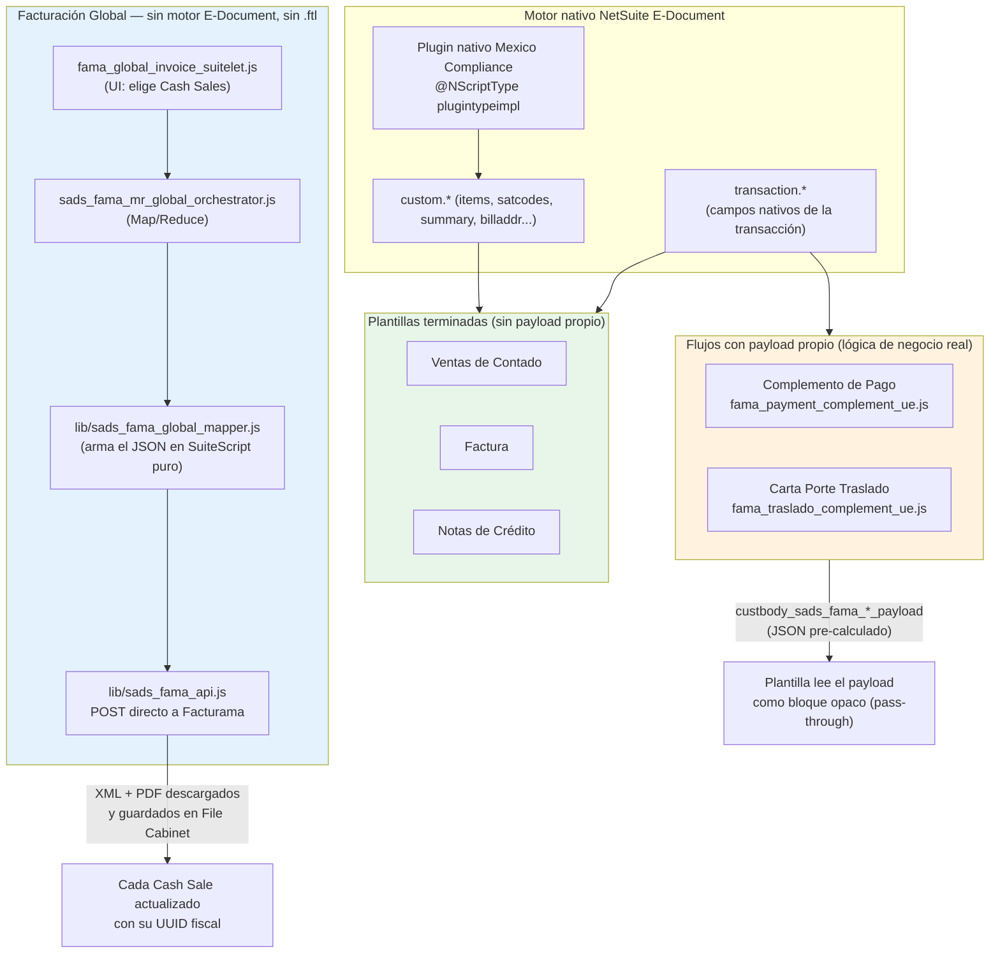
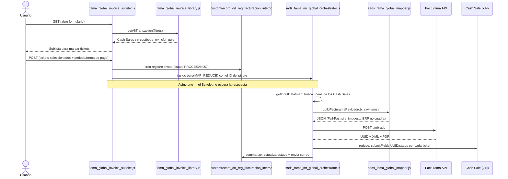
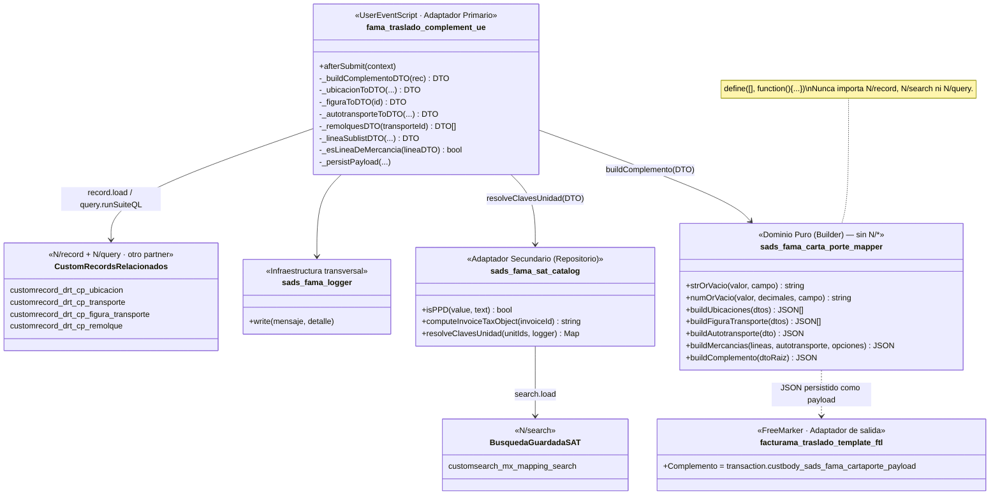
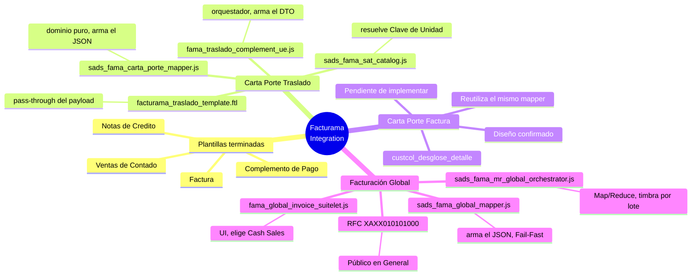

# Resumen del Estado del Proyecto — NS PAC Integration Facturama

Fecha de corte: 2026-09-30. Fuente: estado real del repositorio (`git status`/`git log`) y del
código leído en esta sesión — no se reporta nada que no se haya verificado directamente.

## 1. Resumen ejecutivo

Integración NetSuite ↔ Facturama (PAC de CFDI 4.0) para el grupo Almetal/NH Aceros/PFP. Genera
el JSON que Facturama certifica, a partir de plantillas FreeMarker (`.ftl`) que combinan datos
nativos de NetSuite E-Document (`transaction`, `customer`, `companyinformation`, y el objeto
`custom` inyectado por el plugin nativo de la SuiteApp "Mexico Compliance") con payloads propios
pre-calculados por SuiteScript cuando el dato requiere lógica de negocio (Complemento de Pago,
Complemento Carta Porte).

Arquitectura declarada en `CLAUDE.md`: Ports & Adapters — la lógica de negocio vive en
User Events/módulos `lib/*.js` (dominio/aplicación); las plantillas `.ftl` son adaptadores puros
de salida, nunca deciden ni calculan.

## 2. Estado por plantilla/CFDI

| Plantilla | CfdiType | Estado | Script(s) SuiteScript |
|---|---|---|---|
| Ventas de Contado | I | **Terminada** | — (usa mecanismo nativo `custom.items`) |
| Factura | I | **Terminada** | `fama_invoice_tax_object_ue.js` (cachea ObjetoImp) |
| Complemento de Pago | P | **Terminada** | `fama_payment_complement_ue.js` |
| Notas de Crédito | E | **Terminada** | — (usa mecanismo nativo `custom.items`) |
| Comprobante de Traslado (Carta Porte) | T | **En desarrollo** — refactor arquitectónico recién completado, pendiente reprueba en sandbox | `fama_traslado_complement_ue.js` + `lib/sads_fama_carta_porte_mapper.js` + `lib/sads_fama_sat_catalog.js` |
| Factura con Complemento Carta Porte | I | **Diseño completo, implementación pausada** por decisión explícita del usuario | No iniciado — reutilizará el mismo mapper |
| Facturación Global (Público en General) | I | **Implementada** — flujo independiente, no usa plantilla `.ftl` | `fama_global_invoice_suitelet.js` + `fama_global_invoice_client.js` + `fama_global_invoice_library.js` + `sads_fama_mr_global_orchestrator.js` + `lib/sads_fama_global_mapper.js` |

## 3. Arquitectura general — tres mecanismos de generación conviviendo

Las 4 plantillas ya terminadas construyen su CFDI **enteramente dentro del `.ftl`**, leyendo el
objeto `custom` que arma un plugin nativo de NetSuite (`@NScriptType plugintypeimpl`, no es código
de este proyecto) — sin ningún payload propio. Traslado (y el futuro Factura+CartaPorte) necesitan
un payload propio porque el Complemento Carta Porte cruza varios custom records de otro partner
(`customrecord_drt_cp_*`) que el plugin nativo no resuelve. **La Facturación Global es un tercer
mecanismo, completamente distinto de los otros dos**: no pasa por el motor de E-Document de
NetSuite ni por ninguna plantilla `.ftl` — es un flujo batch (Suitelet + Map/Reduce) que arma el
JSON en SuiteScript puro y lo envía directo a la API HTTP de Facturama.

### 3.1 Facturación Global — flujo completo

Consolida varios tickets de Venta de Contado (Cash Sale) **sin UUID fiscal aún** en un solo CFDI
de Ingreso a nombre de "PÚBLICO EN GENERAL" (RFC genérico `XAXX010101000`, régimen `616`,
`CfdiUse S01`) — el mecanismo estándar del SAT para ventas de mostrador no facturadas
individualmente.

**Regla de negocio propia de este flujo** (`sads_fama_global_mapper.js`): si la matemática del
ERP ya cuadra (`impuesto = base × tasa` dentro de tolerancia), se usa tal cual; si el ERP
redondeó, se recalcula base/impuesto desde el total real. Si la discrepancia entre el impuesto del
ERP y el recalculado supera 0.05, la línea se rechaza con `Fail-Fast` explícito ("registro
contable corrompido") — no se envía un CFDI con cifras que no cuadran matemáticamente.

## 4. Diagrama UML — módulos del Complemento Carta Porte (Traslado)

Refleja el refactor de esta sesión: el mapper quedó **sin ninguna dependencia de NetSuite**
(`define([], ...)`), todo el acceso a `N/record`/`N/query` se concentró en el User Event, y
`N/search` quedó aislado dentro del catálogo — separación de responsabilidades (Clean
Architecture / mínimo privilegio, principios citados en `CLAUDE.md`).

Diseñado como cadena vertical (una sola columna de dependencias, `direction TB`) para que quepa
en una hoja carta en orientación vertical — los custom records relacionados y el buscador nativo
se agruparon en una sola caja cada uno en vez de esparcirse en paralelo.

## 5. Mapa mental — cómo funciona cada módulo

## 6. Convenciones y disciplina de proyecto (vigentes, no negociables)

- **Fail-Safe vs Fail-Fast**: los User Event nunca bloquean el guardado (log y continúan); el
  Fail-Fast fiscal (no timbrar incompleto) vive en la plantilla (`<#stop>`) o en el modo
  diagnóstico `_vacia`, nunca deteniendo NetSuite.
- **Comentarios en código**: solo JSDoc + aclaraciones puntuales. El porqué de una decisión va en
  `docs/development-log.md` o en el commit — nunca en el código.
- **"No asumas, verifica"**: cada mecanismo reutilizado del bundle nativo (`resolveClavesUnidad`,
  el objeto `custom`) se confirmó leyendo el código fuente decompilado del bundle antes de
  replicarlo, no por analogía.

## 7. Pendientes abiertos (verificados, no supuestos)

- Reprobar Traslado en sandbox tras el refactor de esta sesión (la firma pública del mapper
  cambió por completo) — confirmar que el XML certificado sigue siendo idéntico.
- Reemplazar el harness ad hoc de Node (scratchpad) por una prueba Jest real
  (`test/sads_fama_carta_porte_mapper.test.js`) — pendiente, no iniciado.
- `NameId` de la futura plantilla Factura+CartaPorte — trámite externo en el portal de Facturama,
  no confirmado.
- Confirmar en sandbox que `custcol_drt_cp_pesoenkg`/`custcol_drt_cp_materialpeligroso`/`units`
  existen con el mismo comportamiento en el sublist de línea de Invoice (solo se confirmaron los
  campos de cabecera contra un XML real).
- Decisión abierta con el usuario: si el filtro de `Items[]` en la futura plantilla de Factura
  debe vivir en el `.ftl` (como hoy) o moverse al User Event, dada la tensión con la regla de
  CLAUDE.md de que las plantillas no deciden nada.
